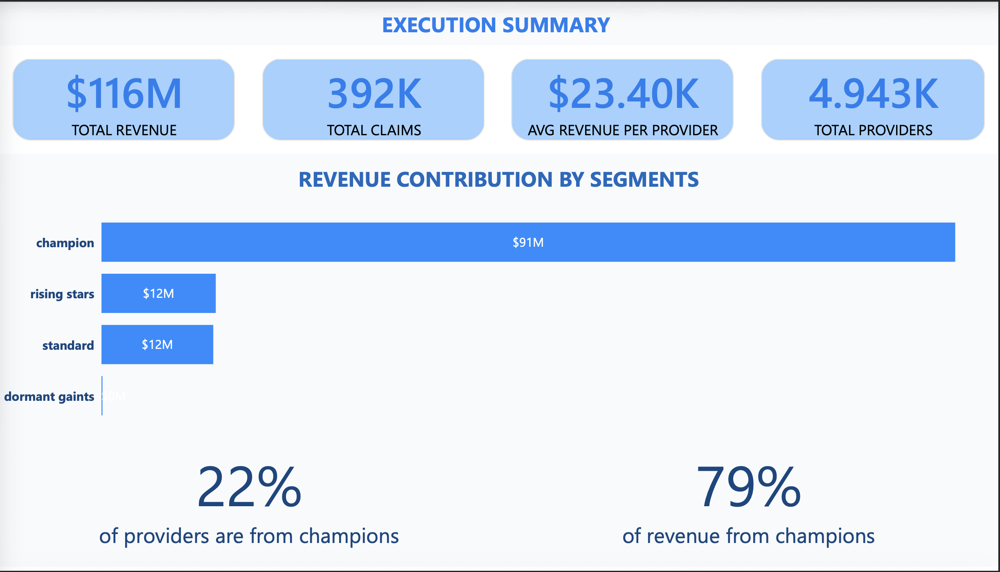
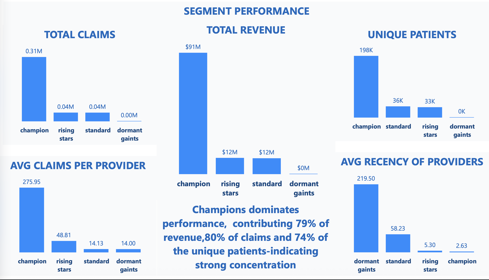
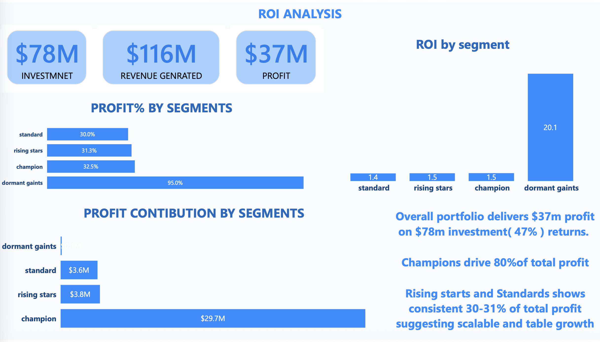

# 🏥 Healthcare Provider Segmentation & ROI Analysis

**An end-to-end data analytics project identifying high-value healthcare providers and optimizing sales resource allocation to maximize ROI.**

---

## 📊 Project Overview

This project analyzes **517,737 Medicare outpatient claims** across **4,943 healthcare providers** to create a strategic segmentation model that identifies high-value providers and optimizes sales force allocation.

### **Business Problem**
A pharmaceutical company was treating all 5,000 doctors the same way, leading to:
- Wasted resources on low-value providers
- Missed opportunities with high-potential doctors
- No data-driven targeting strategy

### **Solution**
Built a data-driven segmentation model that:
- Identified 4 distinct provider segments based on volume, revenue, and engagement
- Calculated ROI for each segment
- Created actionable recommendations for sales resource allocation

---

## 🎯 Key Findings

### **The 80/20 Rule Confirmed**
- **22% of providers (Champions)** generate **79% of total revenue**
- Champions average **$81,788 revenue** vs **$4,039 for Standard providers** (20x difference)
- Only **2 providers** are dormant, indicating strong retention

### **Segment Performance**

| Segment | Providers | Revenue | Avg Claims/Provider | ROI |
|---------|-----------|---------|---------------------|-----|
| **Champions** | 1,117 (22%) | $91M (79%) | 276 | $68 per $1 |
| **Rising Stars** | 861 (17%) | $12M (11%) | 49 | $18 per $1 |
| **Standard** | 2,963 (60%) | $12M (10%) | 14 | $20 per $1 |
| **Dormant Giants** | 2 (0.04%) | $0.1M (0.1%) | 14 | $281 per $1 |

### **Business Impact**
- **$2.61M quarterly investment** generates **$116M in revenue**
- **Overall ROI: 44:1** ($44 return per $1 invested)
- Champions contribute **80% of total profit** despite being only 22% of providers

---

## 💼 Business Recommendations

### **1. Protect Champions (Priority #1)**
- **Action:** Maintain premium service with 6 visits/quarter
- **Investment:** $1.34M/quarter
- **Return:** Secures $91M revenue base (79% of total)

### **2. Invest in Rising Stars (Priority #2)**
- **Action:** Increase engagement to 4 visits/quarter
- **Rationale:** High activity + growth trajectory = future Champions
- **Investment:** $688K/quarter
- **Expected Impact:** Accelerate conversion to Champion status

### **3. Optimize Standard Segment**
- **Action:** Maintain minimal touch (1 visit/quarter)
- **Rationale:** 60% of providers, only 10% of revenue
- **Investment:** $592K/quarter
- **Result:** Cost-effective coverage of large group

### **4. Re-engage Dormant Providers**
- **Action:** Targeted re-engagement campaign
- **Opportunity:** Highest ROI ($281:1) but only 2 providers
- **Quick Win:** Recover lost high-value relationships

---

## 🛠️ Tech Stack

**Data Processing & Analysis:**
- Python (Pandas, NumPy, Matplotlib, Seaborn)
- Jupyter Notebook

**Database:**
- MySQL
- SQL for data extraction and transformation

**Visualization:**
- Power BI Desktop
- Interactive 4-page dashboard

**Tools:**
- Git & GitHub for version control
- VS Code for development

---

## 📂 Project Structure
```
healthcare-provider-segmentation/
│
├── data/
│   ├── provider_segmentated_final.csv    # Final dataset with segments
│   └── provider_summary.csv               # Provider-level aggregated metrics
│
├── notebooks/
│   ├── healthcare_analysis.ipynb          # Data cleaning & EDA
│   └── segmentation_Buss_roi.ipynb        # Segmentation & ROI analysis
│
├── power_bi/
│   ├── HEALTHCARE_PROJECT.pbix            # Interactive Power BI dashboard
│   └── HEALTHCARE_PROJECT.pdf             # Dashboard export (static)
│
├── sql_scripts/
│   └── claims_clean.sql                   # Database setup & views
│
│
└── README.md
```

---


## 📈 Dashboard Preview

### **Page 1: Executive Summary**

- KPI cards showing total providers, revenue, claims
- Revenue distribution by segment
- Key insight: 79% of revenue from 22% of providers

### **Page 2: Segment Performance**

- Side-by-side comparison of all segments
- Champions dominate across all metrics
- Activity analysis (recency)

### **Page 3: ROI Analysis**
!
- Investment vs revenue comparison
- Profit margins by segment
- Overall portfolio returns: 47%

### **Page 4: Top Performers**

- Individual provider performance table
- Filterable by segment
- Profit % with conditional formatting

---

## 🧠 Methodology

### **1. Data Collection & Cleaning**
- Source: Medicare Part D Prescriber Data (Kaggle)
- 517K+ outpatient claims, 5K+ providers
- Created clean SQL views with only essential fields
- Handled missing values, duplicates, data type conversions

### **2. Exploratory Data Analysis**
- Analyzed distributions using percentiles
- Identified 80/20 rule: Top 25% providers = 65%+ revenue
- Examined recency, frequency, monetary patterns

### **3. Segmentation Strategy**
Created 4 segments using business logic:
- **Champions:** High volume (>66 claims) + High revenue (>$19.7K) + Active (<30 days)
- **Rising Stars:** Medium volume (>24 claims) + Very active (<15 days)
- **Dormant Giants:** High revenue historically but inactive (>50 days)
- **Standard:** All others

### **4. ROI Calculation**
- Defined visit frequency per segment (1-6 visits/quarter)
- Cost per visit: $200
- Calculated returns: Revenue / (Visits × Cost)
- Analyzed profit margins and contribution

### **5. Visualization & Insights**
- Built interactive Power BI dashboard
- 4 pages: Executive Summary, Segment Performance, ROI Analysis, Top Performers
- Focus on actionable business insights

---

## 📊 Skills Demonstrated

**Technical Skills:**
- Data Cleaning & Transformation
- Exploratory Data Analysis (EDA)
- Customer Segmentation
- ROI & Business Metrics Calculation
- SQL Query Writing & Database Design
- Data Visualization (Power BI)
- Python Programming (Pandas, NumPy)

**Business Skills:**
- Strategic Segmentation
- Resource Allocation Optimization
- ROI Analysis & Financial Modeling
- Stakeholder Communication
- Data-Driven Decision Making

---

## 💡 Future Enhancements

- [ ] Predictive modeling: Identify providers likely to become Champions
- [ ] Time series analysis: Forecast revenue trends by segment
- [ ] Geographic clustering: Territory optimization
- [ ] A/B testing framework: Test different engagement strategies
- [ ] Automated reporting: Monthly performance dashboards

---

## 👤 Author

**[DHRUV TIWARI]**
- LinkedIn: https://www.linkedin.com/in/dhruv-tiwari-9a8014281/
- Email: dhruvtiwari294@gmail.com

---


##  Acknowledgments

- Dataset: Medicare Part D Prescriber Data (Kaggle)
- Inspiration: Real-world pharmaceutical sales optimization challenges
- Built as part of data analyst portfolio for consulting firm applications

